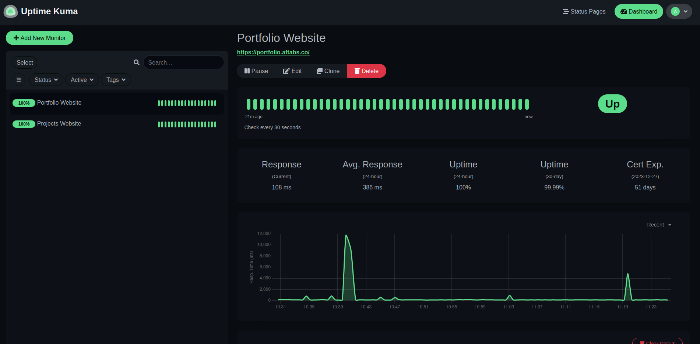

# Website Monitoring with Uptime Kuma: A Comprehensive Guide

In today's world, making sure your websites are always up and running smoothly is super important. If your site goes down, you could lose money, and people might not trust it as much. That's where Uptime Kuma comes in! It's like a helpful friend for your website, keeping an eye on things. In this easy guide, we'll show you how to set up and use Uptime Kuma to make sure your online stuff stays awesome.

### Why Does It Matter?
Imagine your website is like a shop. If it's closed or not working well, customers can't come in, and you might lose sales. Uptime Kuma helps prevent that. It's like having a superhero sidekick for your website. Uptime Kuma is a cool tool that watches over your website 24/7. It makes sure everything is working smoothly so your visitors have a great experience.

### Let's Do It - Step by Step
Running Uptime Kuma using Docker can simplify the deployment process and make it easier to manage dependencies. Here's a basic guide on how to run Uptime Kuma using Docker. 

#### Prerequisites: Docker & Docker Compose

1. Install Docker and Docker-Compose.
    <p>Open your terminal and run the following commands</p>
```
sudo apt install docker.io -y
sudo apt install docker-compose -y
```

2. Uptime Kuma Setup
    <p>Create a new directory and paste the following to make a docker-compose file</p>

```
mkdir uptime-kuma
cd uptime-kuma
sudo nano docker-compose.yml

# paste the compose file

version: '3.8'

services:
  uptime-kuma:
    image: louislam/uptime-kuma:1
    container_name: uptime-kuma
    volumes:
      - uptime-kuma:/app/data
    ports:
      - "3001:3001"  # <Host Port>:<Container Port>
    restart: always

```

3. Run the Docker Container

```
sudo docker-compose up -d
```
You can access the uptime-kuma login page at <b>localhost:3001</b>.

### Adding Monitors
#### Login
To kick things off, log in using the default credentials. It's like unlocking the door to your website's monitoring hub.

#### Add a Monitor

Navigate to the "Monitors" section and click on "Add Monitor." This is where you tell Uptime Kuma which parts of your website to keep an eye on. Just like setting up a security system for your digital space.

#### Save the Monitor

After filling in details like the name and URL, hit "Save Changes." It's like confirming the settings on your favorite app – simple and straightforward.



### Monitor and Alerts: Keeping You In the Loop
#### Dashboard

The main dashboard is your go-to place for a real-time overview of your monitors. Green means all systems are a go, while red alerts you to any issues. It's like a traffic light for your website.

#### Alerts

Head over to the "Settings" section to configure alerts. Uptime Kuma can shoot you a message when a monitor detects an issue. It's like having a digital assistant that taps you on the shoulder when something needs attention.

#### Notification Channels

Set up notification channels, like email or Slack, to receive alerts. It's similar to choosing how you want to be notified – whether it's a friendly email or a quick Slack message.

#### AAdditional Configuration: Tailoring Uptime Kuma to Your Needs

#### SSL (Optional)

If you want to add an extra layer of security, enable SSL by configuring it in the .env file. It's like putting a digital lock on your website's front door.

#### Reverse Proxy (Optional)

If you're using a reverse proxy (like Nginx), configure it to forward requests to Uptime Kuma. Think of it as ensuring that all the digital traffic reaches the right destination smoothly.

### Conclusion
In conclusion, Uptime Kuma is your ally in maintaining a resilient digital presence. By following these simple steps, you can establish a robust monitoring system, ensuring your website's reliability and performance. Stay ahead of potential issues, minimize downtime, and empower your team with the insights needed to navigate the digital landscape confidently. Happy monitoring! 
